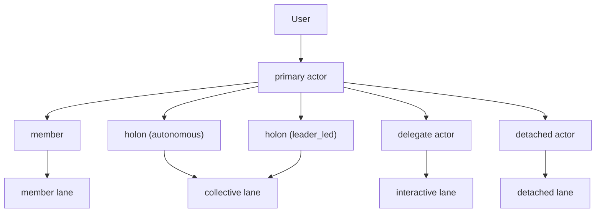

# 如何用 `depa-actor` 实现 AI Agent

本文说明：如果把 `depa-actor` 用作 AI agent runtime，推荐采用什么对象模型、执行模型和调度边界。

本文使用的正式术语与当前 AIAgent 模型保持一致：

- **primary actor**：主会话执行 actor
- **delegate actor**：由 primary actor 派生出的短生命周期协作 actor
- **detached actor**：脱离当前交互回合、独立推进的执行 actor
- **member**：单个长期协作者
- **holon**：组织 actor
- **holon.governance = autonomous**：无 leader、自主领取或任务板推进
- **holon.governance = leader_led**：有 leader、由 leader 承接路由与结果回流

## 1. 核心心智模型

一个稳定的 AI agent runtime，至少要分四层：

1. **对象语义层**：用户如何理解 actor 与组织对象
2. **Actor 层**：谁拥有状态、信箱、生命周期
3. **Fiber 层**：谁被调度、挂起、恢复、终止
4. **Workload 层**：fiber 当前在执行什么工作

简化理解：

- **Actor** 负责状态归属、消息接收、身份边界
- **Fiber** 负责调度推进、暂停恢复、执行时机
- **Workload** 负责当前这次具体执行内容

## 2. 正式对象模型

### 2.1 execution semantics

- `primary`
  - 用户直接面对的主执行 actor
- `delegate`
  - 由 primary actor 派生出的短生命周期执行体
- `detached`
  - 不再依附当前交互回合、可独立推进的执行体

### 2.2 organization semantics

- `member`
  - 单个长期协作者
- `holon`
  - 组织对象的统一正式类型
  - `governance = autonomous` 表示无 leader 的自治组织
  - `governance = leader_led` 表示有 leader 的路由组织

这两组概念是正交的：

- `member / holon` 解决“对象是谁”
- `primary / delegate / detached` 解决“怎么执行”
- `holon.governance` 解决“组织如何治理”

## 3. Actor 层职责

Actor 层最适合承接：

- 消息历史
- system prompt / 工作记忆
- mailbox 消息接收
- 工具权限与策略限制
- watched 状态
- `cancel` / `shutdown` 等控制语义

一个面向 AI agent 的 actor，通常会有这些 mailbox：

- `humanInput`
- `coordination`
- `memberInbox`
- `toolResult`
- `childDone`
- `control`

关键原则：

- 控制语义尽量消息化
- watched 状态属于 actor / holon 对象状态，而不是临时 UI 标记

## 4. Fiber 与 lane

Fiber 层不解决“业务对象是谁”，只解决“现在谁运行”。

在 AI agent runtime 中，常见的调度域是：

- `interactive`
  - 主交互回合
- `member`
  - 单成员协作通信
- `collective`
  - autonomous holon 的自治推进 lane
- `background`
  - detached / 长耗时工作

lane 不是新的 actor 类型，而是：

- fiber 的调度语义分组
- 决定不同工作如何被推进与隔离

其中 `collective lane` 仍可以作为内部调度名存在，但它不再是正式组织对象种类；正式组织对象统一为 `holon`。

## 5. 推荐映射

### 5.1 primary actor

- 拥有主会话历史
- 接收用户输入
- 决定是否派生 delegate / detached actor
- 负责 member / holon 的创建与编排

### 5.2 delegate actor

- 处理一次局部子任务
- 可以同步完成，也可以转入 detached 执行
- 生命周期通常较短

### 5.3 detached actor

- 用于 Bash / ToolCall / 长耗时工作等脱离当前回合的执行
- 不应再被建模成“只是一个后台任务视图”

### 5.4 member / holon

- `member`
  - 面向长期协作
- `holon(governance=autonomous)`
  - 组织内无 leader，自主领取或推进任务
- `holon(governance=leader_led)`
  - 组织内有 leader，由 leader 承接更强的组织控制语义

## 6. assign / watch / unwatch

推荐把任务派发统一成一个动词：`assign`。

三种模式：

```text
assign   -> final
assign:n -> none
assign:s -> stream
```

说明：

- 若某些命令面提供 `assign:r`，它只是显式 final 的别名
- 正式 tool mode 语义仍是 `final / none / stream`

语义：

- `assign`
  - request/response，返回最终结果
- `assign:n`
  - 单向投递，不等待回传
- `assign:s`
  - 流式回传，并让目标进入 watched 状态

`watch / unwatch` 只控制持续监听，不创建任务。

## 7. 为什么 `depa-actor` 适合这类系统

因为它天然适合表达：

- actor 拥有稳定状态
- fiber 被调度器推进
- mailbox 驱动消息流
- control / childDone / toolResult 等异步控制链路
- 不同 lane 的推进策略

换句话说，`depa-actor` 适合承担 runtime substrate，而不是直接替代上层对象模型。

## 8. 一个推荐的最小映射



## 9. 推荐结论

如果要用 `depa-actor` 做 AI agent：

- 用 actor 保存长期状态与身份边界
- 用 fiber/lane 表达执行推进
- 用 `primary / delegate / detached` 表达执行语义
- 用 `member / holon` 表达组织语义
- 用 `holon.governance` 表达组织治理差异
- 用统一的 `assign / watch / unwatch` 协议暴露上层能力

这样，runtime 更稳定，也更容易扩展到真实产品交互面。
